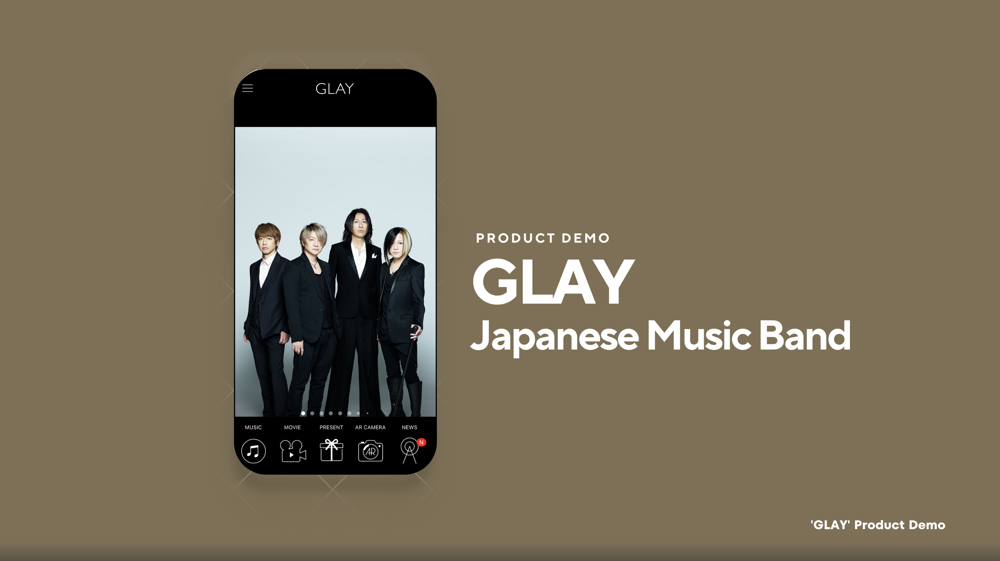
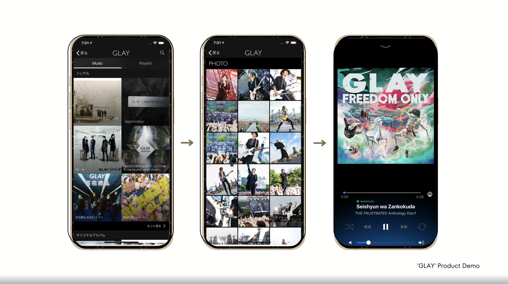
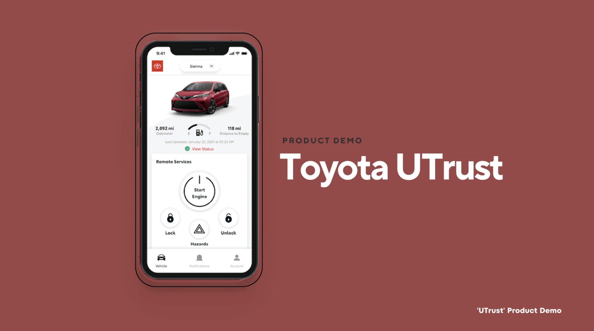
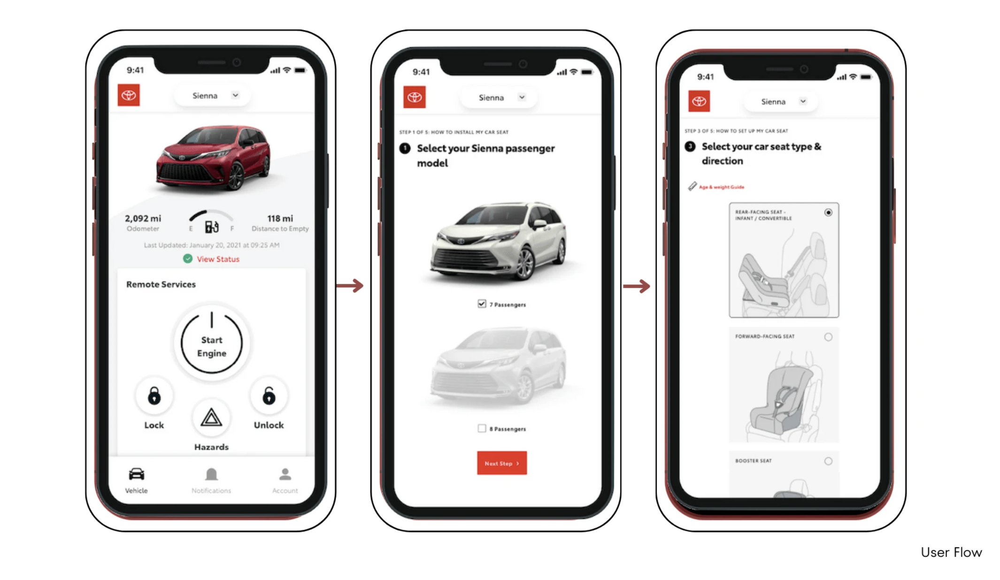
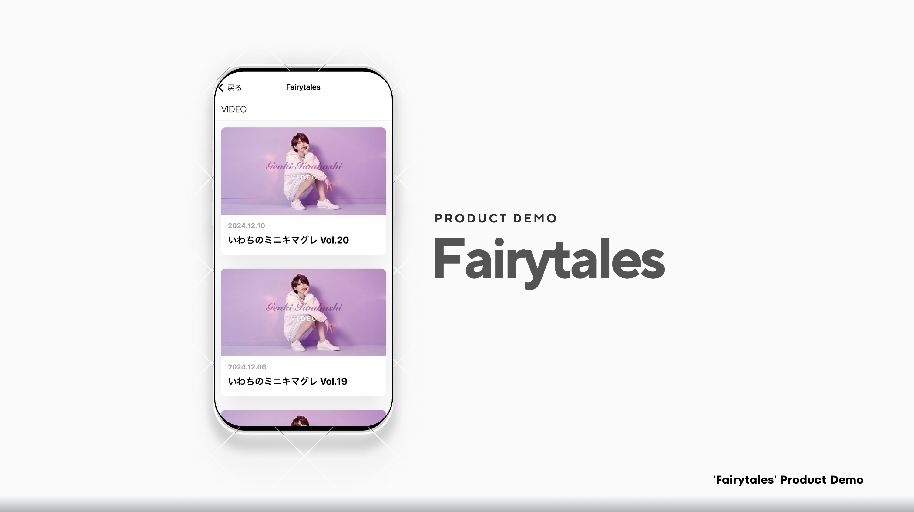
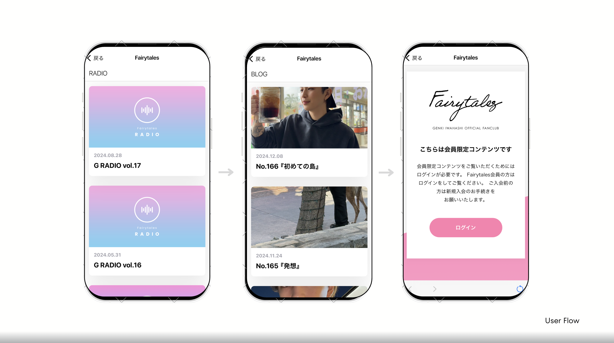
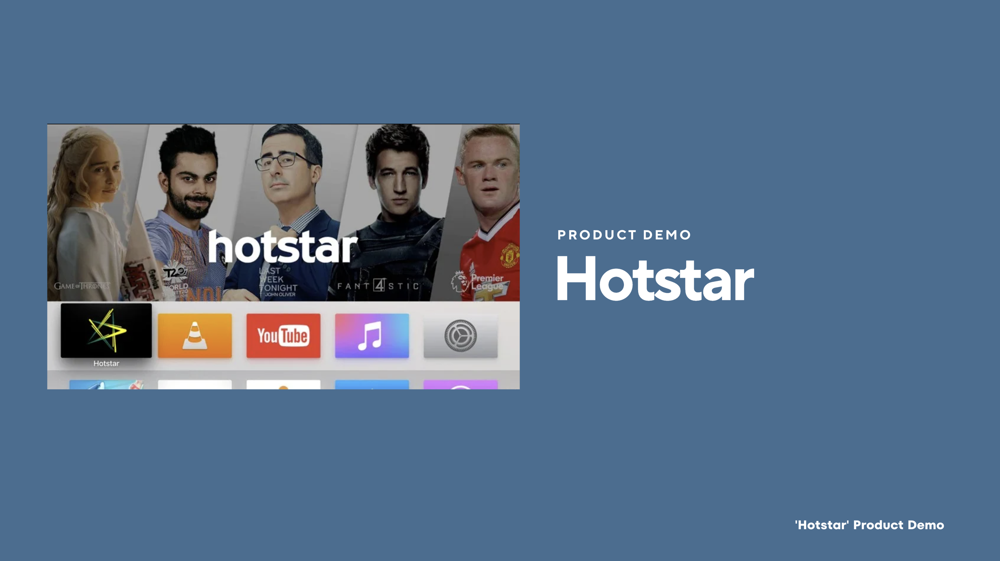
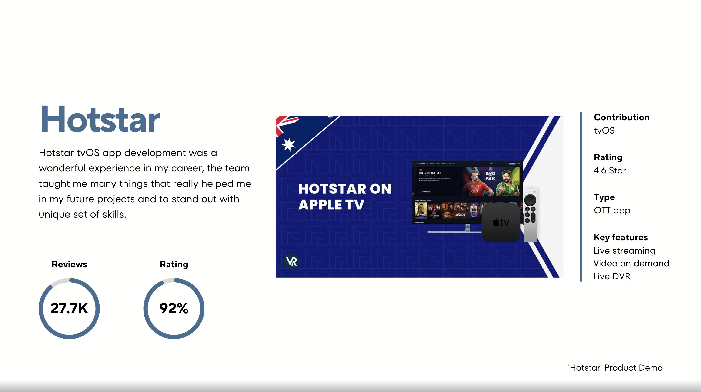
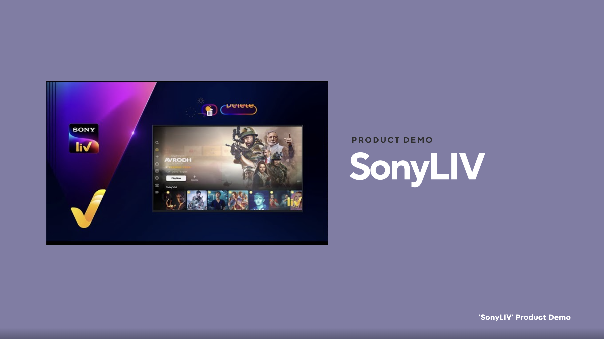
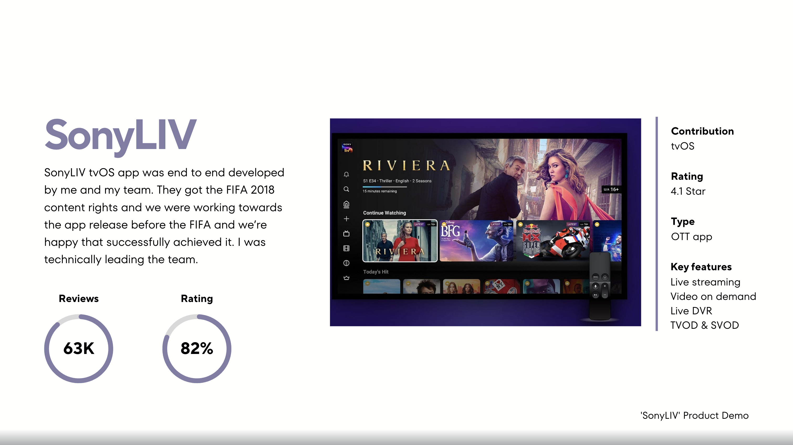

<div align="center">

# 👋 Hi, I'm Rajeev TC

### Senior Mobile Engineer • iOS • Android • tvOS • watchOS


<br/>

📍 Tokyo, Japan

📱 iOS • Android • tvOS • watchOS

💼 Principal iOS Engineer @ DulashPro Solutions

🌏 Open to Global Opportunities

</div>

---

## 🚀 About Me

Senior Mobile Engineer with **12+ years of experience** designing and building scalable mobile applications across:

- iOS
- Android
- tvOS
- watchOS

I have delivered applications used by millions of users across:

🎬 OTT Streaming  
📺 Live Video Platforms  
🎵 Music & Entertainment  
🚗 Enterprise Mobility  
🏥 Healthcare Technology

### Core Expertise

```yaml
Languages:
  - Swift
  - Objective-C
  - Kotlin
  - Java

Frameworks:
  - SwiftUI
  - UIKit
  - Jetpack Compose
  - Android SDK

Architecture:
  - Clean Architecture
  - MVVM-C
  - MVVM
  - SOLID

Streaming:
  - HLS
  - Live Streaming
  - DVR
  - SVOD
  - TVOD

DevOps:
  - Bitrise
  - Fastlane
  - GitHub Actions

AI:
  - ChatGPT
  - Claude
  - Gemini
  - Copilot
```

---

# 🛠 Technology Stack

<p align="center">


</p>

---

# 📈 GitHub Stats

<div align="center">


</div>


# 🎬 Featured Projects
---

## 🎵 GLAY

### Official Japanese Music Platform



### Features

- Music Streaming
- Live Events
- AR Content
- Membership Platform
- Lottery Features

### Technology

```text
SwiftUI
Combine
Clean Architecture
Dependency Injection
StoreKit
```



---

## 🚗 Toyota UTrust

### Enterprise Mobility Platform



### Project Scope

- Vehicle Procurement
- Sales Workflow
- Valuation System
- Inventory Management

### Leadership

👨‍💼 Led team of 10 iOS Engineers

### Technologies

```text
Swift
UIKit
Vision Framework
CoreBluetooth
MVVM-C
```



---

## 🎵 Fairytales

### Official Fan Club Application



### Features

- Premium Content
- Video Streaming
- Radio
- Membership Portal
- Progressive Web Content

### Technologies

```text
SwiftUI
Combine
StoreKit
Web Integration
```



---

## 📺 Hotstar tvOS

### OTT Streaming Platform



### Highlights

- Live Streaming
- Video On Demand
- DVR Support
- Apple TV Platform
- High Traffic Streaming Architecture

### My Contribution

- tvOS Development
- Video Playback Features
- OTT Architecture
- Performance Optimization



---

## 📺 SonyLIV tvOS

### OTT Streaming Platform



### Highlights

- Live Streaming
- SVOD & TVOD
- DVR Features
- Apple TV Application

### Leadership

- Technical Lead
- End-to-End Development
- FIFA 2018 Release Delivery



---

# 💼 Professional Experience

| Company | Role | Duration |
|----------|-------|-----------|
| DulashPro Solutions | Founder & Principal Mobile Engineer | 2025 - Present |
| Hivelocity Inc | Senior Software Engineer | 2020 - 2025 |
| Ascendum | Lead iOS Engineer | 2018 - 2019 |
| Valtech | Senior iOS Engineer | 2016 - 2017 |
| Srishti Innovative | iOS Engineer | 2013 - 2015 |

---

# 🏆 Career Highlights

✅ 12+ Years Experience

✅ 60+ Mobile Applications Delivered

✅ OTT Streaming Expert

✅ Led Teams of 10+ Engineers

✅ iOS • Android • tvOS • watchOS

✅ Enterprise & Consumer Products

✅ AI-Assisted Development Workflows

✅ End-to-End Product Development

---

# 📚 Current Focus

```swift
struct CurrentFocus {

    let learning = [
        "AI Assisted Development",
        "Swift Concurrency",
        "Android Compose",
        "System Design",
        "Large Scale Mobile Architecture"
    ]

    let building = [
        "Healthcare Applications",
        "AI Enabled Mobile Products",
        "Cross Platform Solutions"
    ]
}
```

---

## 🔭 Current Work
- **[SurgicalPlanningApp](https://github.com/rajeevtc/SurgicalPlanningApp)** - A surgical planning solution
- **[FluxSenseApp](https://github.com/rajeevtc/SurgicalPlanningApp)** - A EMF Detector solution

## 🌱 What I'm Learning
- Leveraging AI to speed up development processes

## 💡 Expertise & Focus Areas
- **SwiftUI** | **Scalable iOS/tvOS/watchOS Apps** | **Native App Development**
- High-performance app architecture and optimization

---

# 🤝 Let's Connect

<div align="center">

[](https://linkedin.com/in/rajeevtc)

[](mailto:rajeevtchacko@gmail.com)

[]()

</div>

---

<div align="center">

### "Building Mobile Products That Scale To Millions"

⭐ If you like my work, feel free to connect!

</div>


*Last updated: 2026-05-04*
